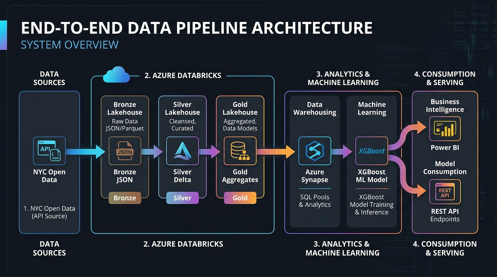
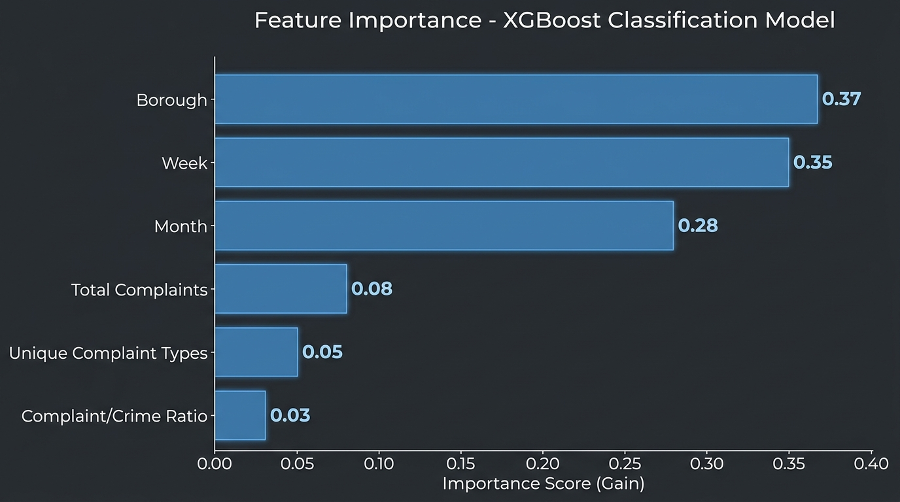
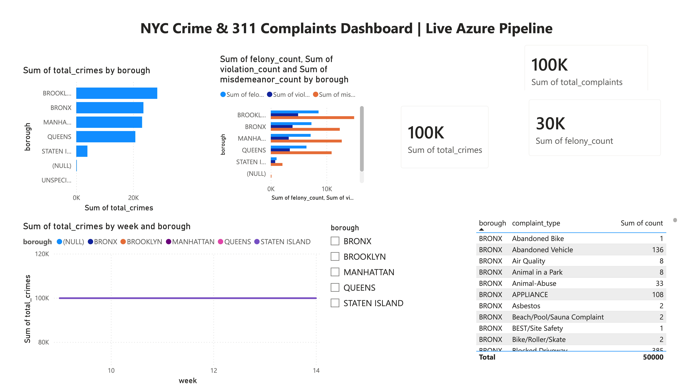

# End-to-End Azure Data Pipeline: NYC Open Data → Databricks → Synapse → Power BI → XGBoost → REST API

A production-grade, end-to-end data engineering and machine learning pipeline that ingests raw New York City Open Data, processes it using a Medallion Architecture in Azure Databricks, stores analytics-ready tables in Azure Synapse, visualizes insights via a Power BI Dashboard, trains an XGBoost model using Leave-One-Borough-Out cross-validation to predict weekly crime spikes, and deploys the model as a serverless Azure Function REST API.

---

## 🏗️ System Architecture Overview

The system runs as a fully orchestrated cloud pipeline using **Azure Data Factory**:
1. **Ingestion**: Raw JSON data is pulled via the Socrata Open Data API (311 Complaints and NYPD Crime data) and landed in **Azure Data Lake Storage (ADLS) Gen2 (Bronze Container)**.
2. **Databricks Processing (Medallion Architecture)**:
   - **Bronze**: Validate raw JSON files and schema shape.
   - **Silver**: Clean, trim, cast ISO 8601 timestamps, engineer date partitions, and save as optimized **Delta Lake** tables.
   - **Gold**: Generate weekly aggregates, compute complaint-to-crime ratios, build the master ML feature table, and export dimensions.
3. **Data Warehousing**: Synapse Analytics ingests Gold Delta tables for high-performance warehousing.
4. **Business Intelligence**: Power BI queries Synapse to present real-time dashboards of city health, crime distributions, and complaints.
5. **Machine Learning & MLOps**: XGBoost model trains on Gold data, runs Leave-One-Borough-Out (LOGO) cross-validation, exports performance metrics to ADLS, and persists the final model artifact.
6. **Model Consumption**: An Azure Function API loads the model from ADLS to serve predictions on-demand.



---

## 📁 Repository Structure

```
.
├── notebooks/
│   ├── config.py                         # Shared ADLS storage path configuration
│   ├── 01_bronze_validate.py             # Phase 1: Raw JSON validation
│   ├── 02_silver_transform.py            # Phase 2: Cleansing and Delta conversion
│   ├── 03_gold_aggregate.py              # Phase 3: Analytical aggregates & ML feature store
│   └── 04_feature_engineering_training.py # Phase 4: XGBoost LOGO CV training & model export
├── azure_functions/
│   ├── function_app.py                   # Serverless HTTP Trigger predicting crime spikes
│   ├── requirements.txt                  # Python dependencies (xgboost, scikit-learn, numpy)
│   └── host.json                         # Azure Functions host-level settings
├── docs/
│   └── screenshots/
│       ├── architecture_diagram.jpg      # System overview diagram
│       ├── feature_importance.jpg        # XGBoost feature importance chart
│       └── powerbi_dashboard.png         # Power BI report screenshot
└── README.md
```

---

## ⚙️ Medallion Pipeline Execution Steps

### 1. Bronze Layer (`01_bronze_validate.py`)
Validates incoming raw JSON payloads. It reads multiline JSON direct from ADLS Gen2 `abfss` storage paths, verifies row/column counts, and prints a visual preview of the raw structures.

### 2. Silver Layer (`02_silver_transform.py`)
Cleanses and structures the raw data:
- Standardizes schema column selections for 311 and Crime datasets.
- Parses ISO 8601 timestamps dynamically to standard Pyspark `timestamp` types.
- Extracts calendar columns (`year`, `month`, `week`) for temporal analytics.
- Standardizes borough strings (uppercasing, trimming whitespace).
- Writes the cleaned records to Silver storage in **Delta** format.

### 3. Gold Layer (`03_gold_aggregate.py`)
Aggregates datasets for dashboard consumption and machine learning:
- Generates **Weekly Complaints** grouped by borough, year, month, and week.
- Generates **Weekly Crimes** broken down by severity categories (`FELONY`, `MISDEMEANOR`, `VIOLATION`).
- Joins weekly datasets to produce the **Master ML Feature Table** containing complaint-to-crime ratios.
- Creates categorical breakdowns of complaints and crimes for Power BI dimensions.
- Writes all analytical views back as partitioned Delta tables.

---

## 🤖 Machine Learning & MLOps Model Pipeline

### Feature Engineering
The model is designed to predict **whether a borough will experience a crime spike (defined as >500 total crimes) in the subsequent week**.
To prevent **data leakage**, the model only utilizes 311 service request metrics and temporal details from the *current* week to predict crimes in the *next* week:
- `borough_encoded` (Categorical mapping: Bronx=0, Brooklyn=1, Manhattan=2, Queens=3, Staten Island=4)
- `week` (Calendar week number)
- `month` (Calendar month)
- `total_complaints` (Service volume)
- `unique_complaint_types` (Service request variety)
- `complaint_crime_ratio` (Relative ratio)

### Leave-One-Borough-Out Cross-Validation
To guarantee spatial generalizability, we implement **Leave-One-Borough-Out (LOGO) cross-validation**. The model iteratively trains on 4 boroughs and tests on the remaining 5th borough. This ensures that the model is robust and avoids overfitting to any single geographical region.

### Model Evaluation Results
The final XGBoost classifier achieved the following cross-validation performance:
- **Accuracy**: `77.65%`
- **Precision**: `0.7500`
- **Recall**: `0.8667`
- **F1 Score**: `0.8041`

#### Classification Report:
```text
                 precision    recall  f1-score   support

    Normal Week       0.82      0.68      0.74        40
High Crime Week       0.75      0.87      0.80        45

       accuracy                           0.78        85
      macro avg       0.78      0.77      0.77        85
   weighted avg       0.78      0.78      0.77        85
```

### Feature Importance
The relative feature importance from training highlights that the geographical borough location and temporal indicators (week and month) represent the strongest indicators of crime spikes:



---

## ⚡ Serverless API Model Serving

The trained XGBoost model is exported to ADLS, and served via an **Azure Function App** using an HTTP Trigger (`/api/predict`). The serverless function implements lazy-loading of the model to ensure fast response latency and low cold-start impact.

### API Request Schema:
```json
{
  "borough": "BROOKLYN",
  "week": 27,
  "month": 7,
  "total_complaints": 6000,
  "unique_complaint_types": 110,
  "complaint_crime_ratio": 12.5
}
```

### API Response Schema:
```json
{
  "borough": "BROOKLYN",
  "week": 27,
  "prediction": "NORMAL_WEEK",
  "confidence": 0.0972,
  "model_version": "xgboost_v1_leakage_free"
}
```

---

## 📊 Power BI Dashboard Report

The dashboard connects directly to the gold data layer in Azure Synapse to visualize historical trends and monitor live pipeline feeds.



### Key Insights & Metrics Captured:
* **Sum of total_crimes**: Over `100,000` total crimes cataloged.
* **Sum of total_complaints**: Over `100,000` public 311 calls analyzed.
* **Sum of felony_count**: Over `30,000` major offenses tracked.
* **Borough Distribution**: Brooklyn and Bronx exhibit the highest volume of both crimes and 311 service complaints.
* **Weekly Crime Severity Breakdown**: Analyzes the relationship between misdemeanors, violations, and felony counts over a weekly rolling average.
* **Complaint Profiles**: Breaks down complaint types (e.g., Abandoned Vehicles, Air Quality, Noise, Blocked Driveways) per borough.
